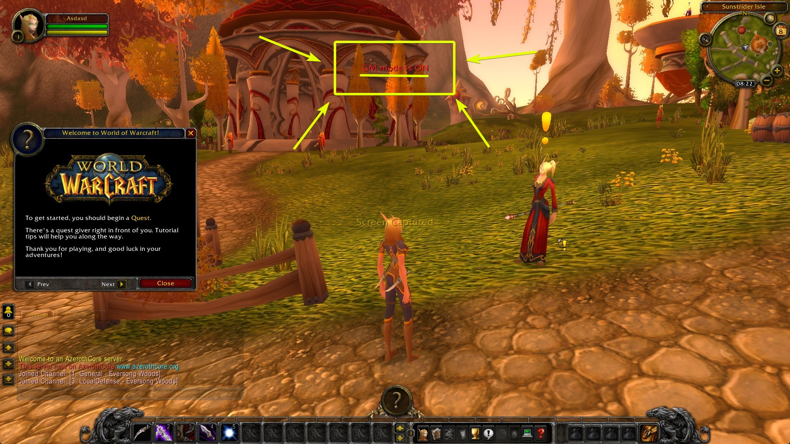

# AzerothCore Ansible

This repository uses [Ansible](https://ansible.com/) to set up and run [AzerothCore](https://github.com/azerothcore/azerothcore-wotlk) - a World of Warcraft 3.3.5a (Wrath of the Lich King) framework - on a [Ubuntu 22.04 server](https://ubuntu.com/server). It does not (officially) support other Linux distributions.

This project is designed to help you continue the educational spirit of AzerothCore and take advantage of its work, **not** host public facing World of Warcraft servers.

## Notes

- This is not a tool for beginners - you are expected to be able to use the command line and have some prerequisite knowledge;
- You do not run AzerothCore as the `root` user, nor do you run it as a user with access to `root` privileges: via `su` or `sudo` -- it's simply **not** required;
- You _do not_ need to provide the World of Warcraft client. This repository also **does not** contain the client;
- We **cannot** (and **will not**) help you obtain the World of Warcraft client (nor will the AzerothCore team);
- This series of Ansible Roles only supports operating AzerothCore **on Linux** - Windows hosts are not supported;

## Original Author

Thanks to the original author, https://github.com/Zoidwaffle/AzerothCore-Ansible.git, for the starting point. I took their work and have, in my opinion, improved upon it (and will continue to do so.)

## Support

- For support with this Ansible code base, checkout the [author's Discord server](https://discord.gg/h2UVFBsXXp)
- For support with [AzerothCore](https://github.com/azerothcore/azerothcore-wotlk), checkout their excellent [Discord server](https://discord.gg/bekucdQK7w)

### Further support

If you need support with Linux, Ansible, programming, and more, then this repository's sponsor [Upload Academy](https://upload.academy/) has various options available. Please consider supporting by buying a micro-course - they're perfect for beginners and people trying to break into the IT field. 

## Usage

The instructions below are straight to point. However, you are expected to know how-to operate a Linux server, the command-line, edit files, and other simple sytem administration tasks. The job of administrating _any_ Linux server isn't easy and this tool doesn't do 90% of the work you must do to keep your server up to date, secure, and more - it just gets AzerothCore installed.

The steps are:

1. Install Ansible locally if you haven't already;
1. Configure the Ansible inventory for your target server;
1. Login as a privileged user (`root` for example) and create a non-privileged user (i.e. `azerothcore`);
1. Execute the `dependencies.yml` Playbook, making sure to use the root user or a user with `sudo` access;
1. Execute the `all.yml` Playbook;
1. Stopping the World Server;
1. Running the World Server manually and creating a GM account (or several);
1. Stopping the (manual) World Server and then using systemd to start it up again;
1. Updating your client's `realmlist.wtf` file;
1. Connecting, logging in, and having fun...

### 1. Install Ansible

You will need a "control node" that has Ansible on it. All this means is: you have to have Ansible installed somewhere. If you're on Windows 10/11 for your desktop, then you'll want to install Python. If you're on Linux or macOS, then you'll likely have Python 3 already installed. Make sure you've got Python Virtual Environments installed too.

Now you simply:

1. Create a Python 3 virtual environment: `python3 -m venv venv`
1. Activate the virtual environment (example shown is for Linux): `. venv/bin/activate`
1. Install Ansible: `pip install ansible`

Now you're ready to go.

### 2. Configure the Ansible Inventory

By default the inventory looks like this:

```ini
[all] 
localhost ansible_connection=local
```

This is fine if you're running Linux locally and want to install AzerothCore there. Most private servers will likely want to be on a remote, Internet facing server, however. If you create a VM in, for example, [DigitalOcean](https://m.do.co/c/25e83a364d8a) (referral code for $200 of credit), then you might change it to something like this (just a random IP I picked):

```ini
[all] 
35.88.252.233 azerothcore_realmlist_ip=35.88.252.233
```

Setting the `azerothcore_realmlist_ip` variable here means AzerothCore will correctly listen on the public IP address, allowing you to access the server remotely. 

### 3. Set up the server at the OS level

First, connect/login as the the `root` user or a privileged user and create a **non-privileged** user. I'll assume you've gone with `azerothcore` but you can use anything (and if you're used an SSH Key to get access to `root`, then make sure to copy the `authorized_keys` over to the new, unprivileged user.)

We will use the `dependencies.yml` Playbook to get the server set up and ready to go:

```shell
ansible-playbook dependencies.yml -i inventory.txt --user=root
```

This will install everything you need to download, compile and run AzerothCore.

### 4. Get AzerothCore into place

Now we use the `all.yml` Playbook to run everything needed to set up the database, AzerothCore, and everything else.

```shell
ansible-playbook all.yml -i inventory.txt --user=azerothcore
```

Now we just use the normal, non-privileged user without `su` or `sudo` privileges. You don't need elevated privileges at this point.

Your terminal/console will now fill up with a lot of text... a lot of it. As long as it's not bright red it's fine.

This process can take some time depending on how powerful the server is doing the compilation.

### 5. Stop the World Server

Login to the server as the non-privileged user (`azerothcore` for example).

Because the World Server is running via systemd (in the user scope), you cannot access the console. This is by design: running it in a `screen` session does work, I guess, but it's not ideal. So now we have to stop the server and run it manually:

```shell
systemctl --user stop worldserver
cd ~/azerothcore-wotlk/master/bin/
./worldserver
```

Once the World Server has loaded up, use the AzerothCore console to create a new user and make it a GM:

```shell
account create superdude sssecurepassword
account set gmlevel superdude 3 -1
```

Now hit `Control + C` to stop the World Server and then bring it back up again using systemd:

```shell
systemctl --user start worldserver
```

### 6. Update the `realmlist.wtf`

Update your client's `realmlist.wtf` file to point the `set realmlist` option to the `azerothcore_realmlist_ip` you chose in your inventory file. Based on our examples above, this means you would edit `$WOW_CLIENT_ROOT/Data/enUS/realmlist.wtf` (the `enUS` part could be `enGB` depending on your locale) to look something like this:

```
set realmlist 35.88.252.233
```

Now run the client and login using `superdude` and `sssecurepassword` as the credentials.

### 7. Have fun

Now you have a private Wrath of the Lich King server...



## _Missing_ Features

- I disabled the database backup features of the original code as I believe that something that should be done outside of Ansible (but it can be managed by Ansible)
- There's no support for setting up multiple world server, but I'll add the ability to launch a PTR server soon
- I want to add the feature to download a pre-compiled binary (which I'll eventually provide) instead of the source and compiling everything
- Docker support will never be added as it's pointless for this and there's work being done there anyway

## Workflows

There are going to be times when you'll need to make changes to your AzerothCore and then have everything update. These are going to be referred to as "workflows". I've documented several workflows, below.

### Change the server's IP

If you were running the server from `127.0.0.1` (your local system) and now you want to open it up to the world, then you'll need to change the IPs in the configuration, in the database, and then restart the `authserver` and the `worldserver`.

To achieve this, it's recommend you do the following:

1. Edit the `group_vars/all.yml` file and update `azerothcore_realmlist_ip` to the new (public) IP
1. Execute `ansible-playbook all.yml --user=azerothcore -i <server IP>, --tags configuration,database-init,database-realmlist`
1. Execute `ansible-playbook restart.yml --user=azerothcore -i <serber IP>,`

Your AzerothCore `authserver` and `worldserver` processes should now be listening on the new IP.

### Add a modle to your core

If you want to recompile your code to use a new module, then the following workflow is required. This is an advanced workflow:

1. SSH to your server;
1. Navigate to the `azerothcore_folder` location (probably: `cd ~/azerothcore-wotlk`)
1. Navigate to `source/modules`
1. Copy/clone the module to the current directory
1. Close the SSH session
1. Execute: `ansible-playbook all.yml --user=azerothcore -i <server IP>, --tags source,build`

This isn't all, however. Some modules require that you patch the core. Some require database changes that may or may not be automatically handled by AzerothCore's compilation process. In some cases the above might not be enough... no one said this was going to be easy :-)
